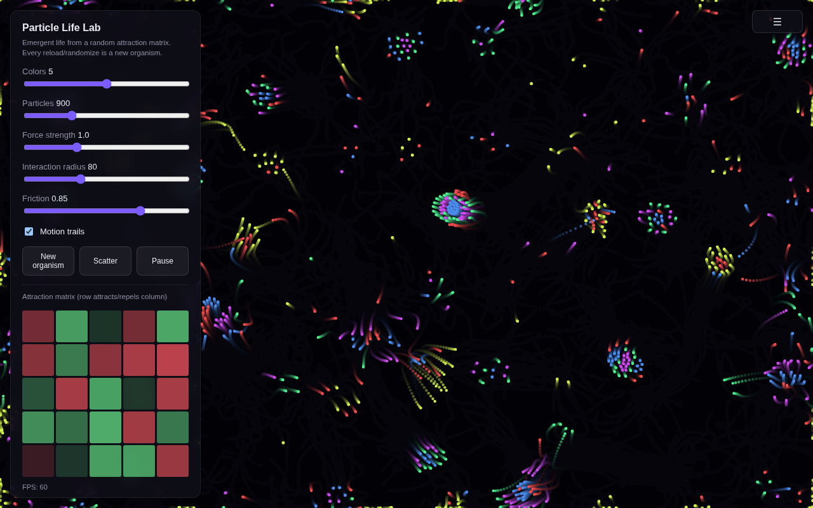

# Particle Life Lab

A zero-dependency, browser-based [particle life](https://en.wikipedia.org/wiki/Particle_Life) simulation. Hundreds of colored particles follow a randomly generated attraction/repulsion matrix between color types — and from that one simple rule, swirling clusters, orbiting pairs, chasing trails, and organism-like blobs emerge on their own. No two runs look the same.

## Run it

No build step, no dependencies. Either:

- Open `index.html` directly in a browser, or
- Serve the folder locally, e.g. `python3 -m http.server 8000` then visit `http://localhost:8000`

## Controls

| Control | Effect |
| --- | --- |
| **Colors** | Number of particle types (each pair gets its own attraction value) |
| **Particles** | Total particle count |
| **Force strength** | Global multiplier on the attraction/repulsion forces |
| **Interaction radius** | How far particles "see" each other |
| **Friction** | Velocity damping per frame |
| **Motion trails** | Toggle the fading-trail render vs. a hard clear each frame |
| **New organism** | Re-roll the attraction matrix — the single biggest lever on behavior |
| **Scatter** | Reset all particle positions without changing the matrix |
| Click/tap canvas | Nudge nearby particles outward |

The attraction matrix panel visualizes the current rules: green cells mean the row's type is attracted to the column's type, red means it's repelled.

## How it works

Each particle only reacts to neighbors within `radius`, looked up via a uniform spatial grid (not a naive O(n²) scan) so a few thousand particles stay smooth. For every neighbor pair, particles apply:

1. A short-range repulsion so particles never fully collapse into each other.
2. A signed force from the attraction matrix (`matrix[typeA][typeB]`) that peaks at mid-range and fades to zero at the edge of the interaction radius.

Velocities are damped by `friction` each frame and positions wrap at the canvas edges. That's the entire rule set — everything visually complex you see is emergent from it.

## Tech

Vanilla HTML5 canvas + JavaScript. No frameworks, no build tooling, no dependencies.

## License

MIT — see [LICENSE](LICENSE).
